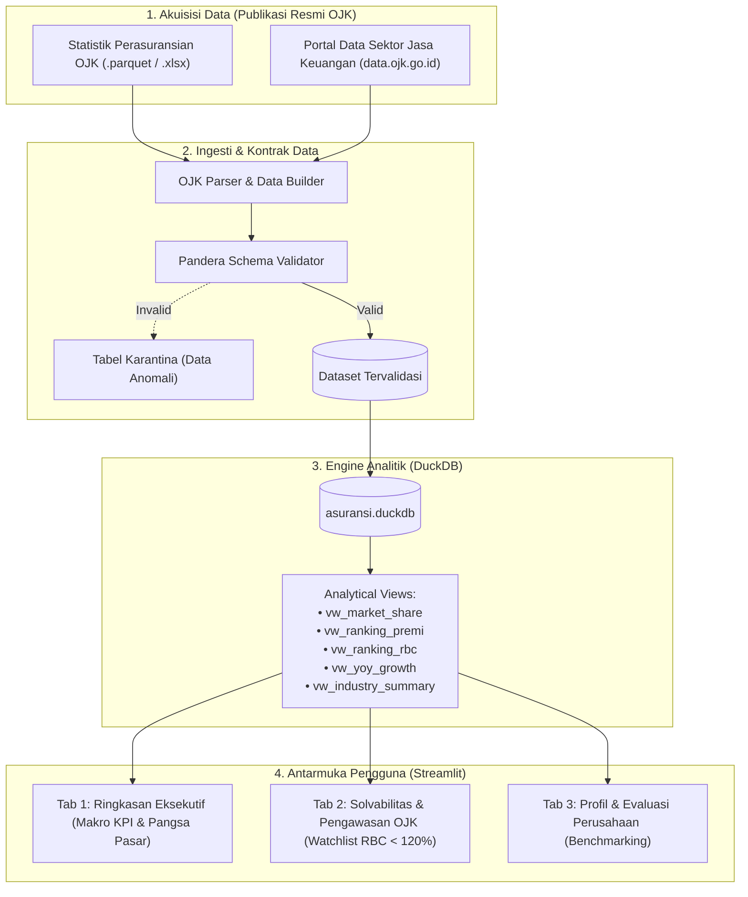

# Arsitektur Sistem: Analisis Kinerja dan Solvabilitas Asuransi

Dokumen ini mendeskripsikan arsitektur sistem, aliran data, kontrak skema Pandera, dan mekanisme keandalan pada dashboard analisis asuransi berbasis data OJK.

---

## 1. Aliran Data (Data Flow)

Pipeline membaca data publikasi OJK, memvalidasi skema finansial dengan Pandera, menyimpannya ke database analitik DuckDB, dan menyajikannya melalui antarmuka Streamlit.

---

## 2. Tech Stack

| Komponen | Teknologi | Alasan Pemilihan |
|:---|:---|:---|
| **Sumber Data** | Data Publikasi OJK | Legal, terverifikasi oleh regulator, dan bebas risiko NDA |
| **Data Ingestion** | Python (`polars` + `openpyxl`) | Efisiensi parsing data tabular dan penulisan berkas Parquet |
| **Data Contract** | `pandera.polars` | Validasi tipe data, format regex ID, dan batasan numerik |
| **Database OLAP** | `DuckDB` | Embedded database berbasis kolom untuk eksekusi query analitik lokal |
| **Visualisasi & UI** | `Streamlit` + `Plotly` | Visualisasi interaktif tanpa dependensi framework frontend terpisah |
| **Package Manager** | `uv` | Manajemen dependensi dan virtual environment yang deterministik |

---

## 3. Spesifikasi Kontrak Data (Pandera)

### 3.1. Entitas Master: `perusahaan_asuransi`
- `kode_perusahaan` (String): ID entitas resmi dengan format `ASR-XXX` (contoh: `ASR-001`).
- `nama_perusahaan` (String): Nama resmi korporasi (3–200 karakter).
- `kategori` (String): Enum `['jiwa', 'umum', 'reasuransi', 'syariah_jiwa', 'syariah_umum']`.
- `tahun_berdiri` (Integer): Tahun pendirian perusahaan (1945–2026).
- `status_izin` (String): Status operasional `['aktif', 'dalam_pengawasan', 'dicabut']`.

### 3.2. Entitas Transaksional: `laporan_keuangan`
- `kode_perusahaan` (String): Foreign Key ke tabel master.
- `tahun_laporan` (Integer): Periode tahun buku laporan fiskal (2015–2026).
- `premi_bruto` (Float): Total penerimaan premi bruto dalam miliar Rupiah ($\ge 0$).
- `klaim_bruto` (Float): Total pembayaran klaim dalam miliar Rupiah ($\ge 0$).
- `rasio_klaim` (Float): Rasio Klaim Bruto / Premi Bruto ($0.0 - 2.0$).
- `rbc_ratio` (Float): *Risk-Based Capital ratio* (Ambang batas minimum POJK: **120.0%**).
- `total_aset` (Float): Total aset entitas dalam miliar Rupiah ($\ge 0$).
- `total_investasi` (Float): Portofolio investasi dalam miliar Rupiah ($\ge 0$).
- `laba_rugi_bersih` (Float): Laba bersih (positif) atau rugi (negatif) dalam miliar Rupiah.
- `ekuitas` (Float): Modal bersih perusahaan dalam miliar Rupiah.

---

## 4. Keandalan dan Penanganan Error

1. **Pencegahan File Locking:**
   - Koneksi database DuckDB di Streamlit menggunakan parameter `read_only=True` agar tidak memicu file lock saat aplikasi dibuka bersamaan.
2. **Perlindungan Skema Data:**
   - Seluruh data yang di-ingest harus memenuhi validasi Pandera. Data yang gagal validasi dipisahkan ke folder karantina untuk peninjauan.
3. **Penanganan Data Kosong:**
   - Dashboard menangani tahun pelaporan yang belum lengkap dengan pesan informatif tanpa menghentikan jalannya aplikasi.
