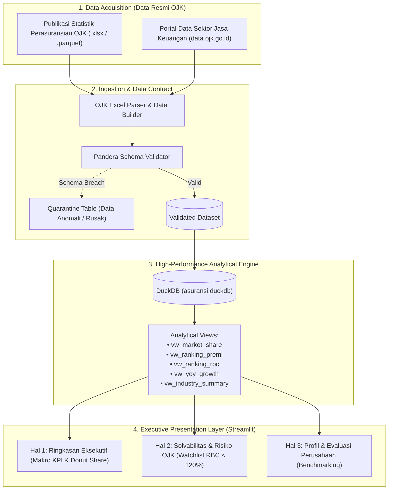

# Arsitektur Sistem: Analisis Komprehensif Industri Asuransi Indonesia

Dokumen ini mendeskripsikan arsitektur sistem, aliran data (*data flow*), spesifikasi kontrak data, dan mekanisme *reliability* untuk proyek **Analisis Komprehensif Industri Asuransi Indonesia** berbasis data resmi publikasi Otoritas Jasa Keuangan (OJK).

---

## 1. High-Level Data Flow

Pipeline dirancang untuk membaca data publikasi OJK, memvalidasi integritas skema finansial, menyimpannya dalam *analytical columnar database* (DuckDB), dan menyajikannya secara interaktif melalui dashboard Streamlit.

---

## 2. Pilihan Tech Stack

| Komponen | Teknologi | Alasan Pemilihan Teknis |
| :--- | :--- | :--- |
| **Sumber Data** | Data Publikasi OJK | 100% legal, merepresentasikan industri asuransi Indonesia riil, bebas risiko NDA. |
| **Data Ingestion** | Python (`polars` + `openpyxl`) | Parsing data Excel multi-level OJK dan file Parquet dengan kecepatan tinggi. |
| **Data Contract** | `pandera.polars` | Validasi tipe data, format ID entitas, dan batas logis metrik keuangan (e.g., Premi >= 0, Rasio Klaim 0.0 - 2.0). |
| **Analytical Engine** | `DuckDB` | Embedded OLAP engine tanpa beban server; query SQL analitik secepat kilat pada file lokal. |
| **Delivery / UI** | `Streamlit` + `Plotly` | Visualisasi interaktif, responsif, dan ringan tanpa dependensi frontend JavaScript yang rumit. |
| **Package Mgmt** | `uv` | Resolusi dependensi deterministik dan instalasi super cepat. |

---

## 3. Data Contract & Schema Specifications (Pandera)

### 3.1. Entitas Master: `perusahaan_asuransi`
*   `kode_perusahaan` (String): ID entitas resmi berformat `ASR-XXX`.
*   `nama_perusahaan` (String): Nama resmi korporasi (contoh: *PT Prudential Life Assurance, PT Asuransi Jasa Indonesia*).
*   `kategori` (String): Enum: `['jiwa', 'umum', 'reasuransi', 'syariah_jiwa', 'syariah_umum']`.
*   `tahun_berdiri` (Integer): Tahun pendirian perusahaan (`1945 - 2026`).
*   `status_izin` (String): Status operasional regulasi (`aktif`, `dalam_pengawasan`, `dicabut`).

### 3.2. Entitas Transaksional: `laporan_keuangan`
*   `kode_perusahaan` (String): Foreign Key ke tabel master.
*   `tahun_laporan` (Integer): Periode tahun buku laporan fiskal (`2015 - 2026`).
*   `premi_bruto` (Float): Total penerimaan premi kotor dalam miliar Rupiah (`>= 0`).
*   `klaim_bruto` (Float): Total pembayaran klaim dalam miliar Rupiah (`>= 0`).
*   `rasio_klaim` (Float): Rasio Klaim Bruto / Premi Bruto (`0.0 - 2.0`).
*   `rbc_ratio` (Float): *Risk-Based Capital ratio* (Batas ketentuan minimum regulasi OJK = **120.0%**).
*   `total_aset` (Float): Total aset entitas dalam miliar Rupiah (`>= 0`).
*   `total_investasi` (Float): Portofolio investasi dalam miliar Rupiah (`>= 0`).
*   `laba_rugi_bersih` (Float): Laba bersih (positif) atau rugi (negatif) dalam miliar Rupiah.
*   `ekuitas` (Float): Modal bersih perusahaan dalam miliar Rupiah.

---

## 4. Keandalan Sistem & Penanganan Error (*Reliability*)

1. **Read-Only Database Locking Prevention**:
   - Streamlit mengakses `asuransi.duckdb` menggunakan parameter `read_only=True` agar proses dashboard tidak mengunci file database saat ada proses pembacaan bersamaan.
2. **Schema Drift Guard**:
   - Setiap berkas OJK baru yang masuk melalui pipeline wajib melewati verifikasi *Pandera*. Baris data yang memiliki nilai di luar batas logis akan disisihkan ke tabel karantina (*quarantine log*).
3. **Graceful Fallback**:
   - Jika data tahun tertentu belum lengkap dipublikasikan oleh regulator, dashboard secara otomatis menampilkan notifikasi informatif tanpa menyebabkan aplikasi crash.
